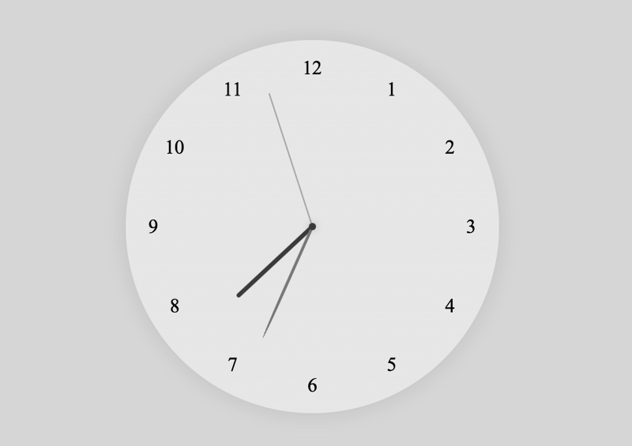

# ANALOG CLOCK (HTML/CSS/JS) 🕒

<p align="center">
  <a href="https://github.com/Soviji13/Learn-FrontEnd-with-me">
    
  </a>
  <a href="https://github.com/Soviji13/Learn-FrontEnd-with-me">
    
  </a>
  <a href="https://github.com/Soviji13/Learn-FrontEnd-with-me">
    
  </a>
  <a href="https://github.com/Soviji13/Learn-FrontEnd-with-me">
    
  </a>
</p>



Basic real-time Analog clock built with **HTML, CSS and JS** to improve my front-end development skills.

🖥️ [Live preview](https://soviji13.github.io/Learn-FrontEnd-with-me/analog-clock/) **here!**

⚡️ **Download the latest version** in this  [`.zip`](https://github.com/Soviji13/Learn-FrontEnd-with-me/raw/refs/heads/main/analog-clock/analogClock.zip) !

>🤠 **No major updates or features** are planned for now — only small improvements might be committed from time to time.

> 👍 Make sure to use an extension in your code editor (like Live Server) —or any other method— to run the app properly (always from index.html). All scripts must be in the same folder as index.html if you don’t want to tweak anything!

> 🇪🇸 All **code comments are written in Spanish**, since it's my native language. If you have any questions, feel free to send me an email!

🧑‍🏫 **In this README you'll learn:**

- ⚙️ The **inner workings of each script** (see the *Project Structure* section). For a deeper understanding, check out the code comments.

- ⚠️ **Key CSS concepts** (covered in *Technical Concepts Learned*). If some comments are unclear, there are examples and video links to help you out.

>📝 **All code and this README are commented as clearly as possible** with the goal of making everything easy to follow - both visually and logically (including the math behind it)

---
## 🚀 USEFUL FEATURES

- ✅ **Real-time updates**: Constant sync with your system clock
- ✅ **Automatic numbers**: Dynamically generated with JavaScript
- ✅ **Differentiated hands**: Each one has an unique design and internal logic
- ✅ **Responsive design**: Looks good on any resolution
- ✅ **Smooth visuals**: Fluid transitions and rotations for every element

> ❗️ Still a few improvements pending for very narrow screen sizes

---

## 📁 PROJECT STRUCTURE

### `🟠 index.html`
Main clock's structure:
- **`#clock`** Main container of hands and design of the dial.
- **`#hr, #min, #sec`** Hands' containers. They are inside *clock*.
- **`#number`** Numbers' container. They are generated from JavaScript, so you cannot see them in *index.html*. They are inside *clock*.
- **Link to stylesheet and JS**.

### `🔵 style.css`
Visual style and layout:
- **Reset CSS**: Removing of default values of padding and margin for all objects. 
- **Clock design**: Radial gradient, shadows, spherical shape. It adapts to screen resolution
- **Central point**: Little circle on the middle using `::before` to *clock*.
- **Hands' containers**: Absolute centered position. Their size is adapted to the clock
- **Hands' design**: Created with pseudo-elements `::before` with different colors and designs
- **Numbers' design**: Absolute position using mathematics (in JS). Their size and position are adapted to the clock

### `🟡 JS` 

**`numbers.js`**

1. Access to `#clock` width so numbers can get positioned and resized according to clock's size 
2. Then, trigonometry is applied to adjust each one iteratively in the correct way
 
**`hands.js`**

1. Access to `#clock` width so they can get positioned and resized using the clock as reference
2. For real-time working, date is got to adjust their rotation degree

>✅ Performance note: All clock updates are handled via setInterval, ensuring smooth ticking every second

---

## 🎯 TECHNICAL CONCEPTS LEARNED

This applies **only to layout-related concepts**, not to the logic.

### 🖥️ Responsive design

Some examples:

```css
/* In .clock - Responsive size */
width: clamp(200px, 80vmin, 600px);
```
```js
/* In numbers.js - Responsive position */
const radius = clock.clientWidth/2;
```

```css
/* In .number - Responsive text */
font-size: clamp(1.25rem, 1vmax + 1rem, 2rem);
```

🤔 **Why should you apply it properly?** Your app or website should look good on every screen size. It's not enough to just scale proportionally — it also needs to be **visually appealing** on any device.

### ⤴️ `::before`

It's a **pseudo-element** used to add visual elements before the content of an element

>It behaves like a child element regarding positioning, relative to the element it's applied to

It's not visible in HTML, however it would be like as:

```html
<!-- This is not actually rendered, just for illustration purposes! -->

<!-- The only visible is <div class="hr" id="hr">content of hr</div> -->
<div class="hr" id="hr">
    <!-- It's not seen in .html, but this would be its function, 
    where ::before is applied -->
    <div class="hr::before">content before the content of hr</div> 
    content of hr
</div>
```
**✅ Benefits?** Simplifies code and HTML structure. 

> **You can also use `::after`**. It works just like `::before`, but —obviously— it comes after.

### 😴 Z-Index

- It is only applied to elements whose `position` is not **static**
- It establishes a **forced hierarchy of how elements overlap** each other
- You must **apply it correctly** (between items, containers, or both... Otherwise it can become a real pain in the neck)

In my case, I only **had to apply it to `#clock::before`**, so the clock's central point could appear above the hands

>👉 I recommend this [Youtube video](https://youtu.be/IaoVa2p6IYo?si=xhEghCHOOixLbr4F) (in Spanish). It helped me **fully understand this concept**. It also shows a good way of how to use this property.


### 📦 CSS Flex-Box

- Makes it **easier to arrange elements inside a container**

- Allows elements **to automatically adapt** to the screen size or available space inside the container

```css
/* Simplified version from my style.css */
body
{
    display: flex;  /* Flex-Box activated in this container */ 
    
    /* Direct children will be centered on both axes */
    justify-content: center;  
    align-items: center;

    /* This will work no matter the clock's size */
}
```
### 🔢 Flow modification with `position` 

- **`position: relative;`** It's usually **applied to containers** so that **their child elements can use it as a reference point**. It doesn't affect the element’s own position in the internal flow

- **`position: absolute;`** Typically **applied to container’s items**. It removes them from the normal web flow and positions them relative to the nearest positioned ancestor (usually one with position: `relative`)

This is **super useful for overlapping elements or placing them exactly where you want** inside a container.

>👉 I recommend this [Youtube video](https://www.youtube.com/watch?v=4WlOokagtR4) (in Spanish). It helped me **fully understand this concept**. 

> There are so many options for *position*, but these are the most important

```css
/* Simplified version of .clock, .hr, .min and .sec */

/* Container */
.clock
{
    position: relative;
}

/* Items - Hands' container */
.hr,
.min,
.sec
{
    position: absolute;

    /* Each hand is placed 50% from the top and left of the container,
       USING .clock's position as a reference*/
    top: 50%;
    left: 50%;
}
```
---

## 📚 TECHNOLOGIES USED

- **HTML5**: Semantic structure
- **CSS3**: Flexbox, pseudo-elements, gradients, transformations
- **JavaScript ES6**: DOM manipulation, mathematical calculations, date and time handling