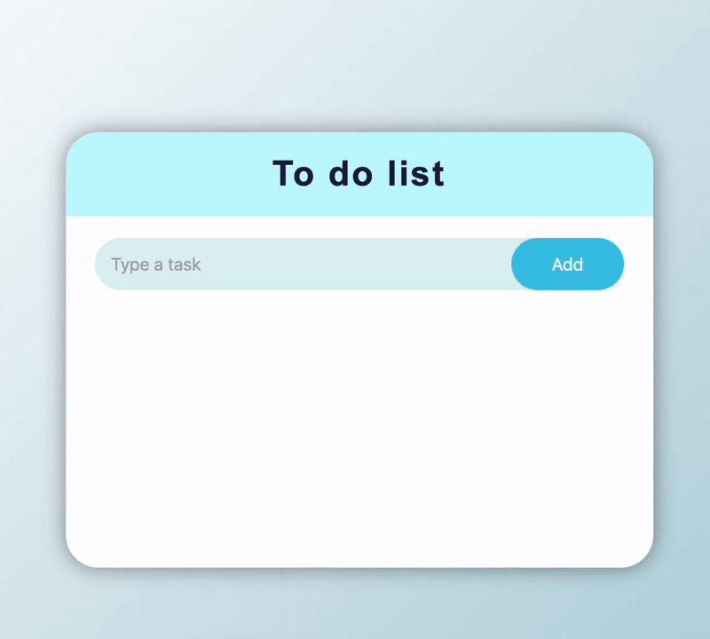

# To Do List 📋

    

    
    
    
    
    

A to-do list, **with basic functions** such as:

- *Delete tasks*
- *Edit tasks* (Double-click on the task)
- *Mark tasks as completed*
- *Save all content in memory*

Additionally, it has keyboard shortcuts such as:

- Enter: To create tasks or confirm modification
- Tab: In task edit mode, to leave it in its initial state
- Up or down arrow: In task edit mode, to edit the next or previous

Made specifically to learn and especially to learn for my future projects.

There are certain things to implement like theme change or the ability to change a task's position.

- Visit this [link](https://soviji13.github.io/Learn-FrontEnd-with-me/to-do-list/) to try it!

- Here you have the [.zip](https://github.com/Soviji13/Learn-FrontEnd-with-me/raw/refs/heads/main/to-do-list/todoList.zip) if you want to download it.

> 🇪🇸 Comments are in Spanish and the code is not properly structured for easy understanding
